# Практическое задание №2

**Coworking Booking System** - веб-приложение для управления рабочими пространствами, комнатами и бронированиями.
Система позволяет:

- создавать и редактировать коворкинги (workspaces),
- управлять комнатами внутри коворкингов,
- бронировать комнаты на определённые временные интервалы,
- проверять пересечения бронирований и корректность данных,
- работать через удобный UI на Thymeleaf.

### Используемый стек

**Backend**

- Java 21
- Spring Boot 4
- Spring MVC
- Spring Data JPA
- PostgreSQL 17
- Liquibase
- Lombok

**Frontend**

- Thymeleaf 3
- Bootstrap 5

### Модели

**Workspace** - рабочее пространство (открытая зона, переговорная, офис)

**Room** -отдельная комната в Workspace

**Booking** - бронь комнаты

### Бизнес-слой

**Интерфейсы**

- BaseService<T, ID>
- WorkspaceService
- RoomService
- BookingService

**Реализации**

- BaseServiceImpl<T, ID>
- WorkspaceServiceImpl
- RoomServiceImpl
- BookingServiceImpl

### API слои

**Workspace API**

`/workspaces`

| Метод  | URL          | Описание                        |
|--------|--------------|---------------------------------|
| GET    | /list        | список всех рабочих пространств |
| GET    | /{id}        | детали workspace                |
| GET    | /create      | форма создания                  |
| POST   | /create      | создание                        |
| GET    | /{id}/edit   | форма редактирования            |
| POST   | /{id}/update | обновление                      |
| DELETE | /{id}        | удаление                        |

**Room API**

`/workspaces/{workspaceId}/rooms`

| Метод | URL              | Описание                |
|-------|------------------|-------------------------|
| GET   | /                | список комнат workspace |
| GET   | /create          | форма создания комнаты  |
| POST  | /                | создание комнаты        |
| GET   | /{roomId}/edit   | форма редактирования    |
| POST  | /{roomId}/edit   | редактирование          |
| POST  | /{roomId}/delete | удаление                |

**Booking API**

`/rooms/{roomId}/bookings`

| Метод | URL                 | Описание                    |
|-------|---------------------|-----------------------------|
| GET   | /                   | список бронирований комнаты |
| GET   | /create             | форма создания              |
| POST  | /                   | создание бронирования       |
| POST  | /{bookingId}/delete | удаление                    |

### Запуск проекта

1. Создать database `aks_2` и схему `coworking`
2. Запустить приложение:

```
mvn spring-boot:run
```

3. Открыть UI:

http://localhost:8080/workspaces/list

### Экраны UI

Экран с рабочими местами

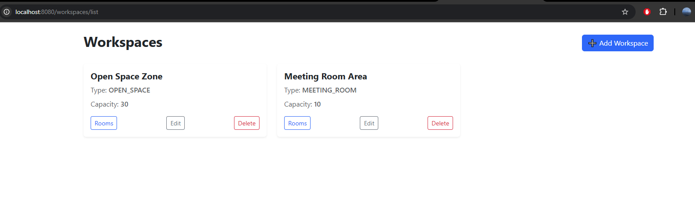

При нажатии на кнопку `Edit` происходит редирект на форму для изменения параметров места

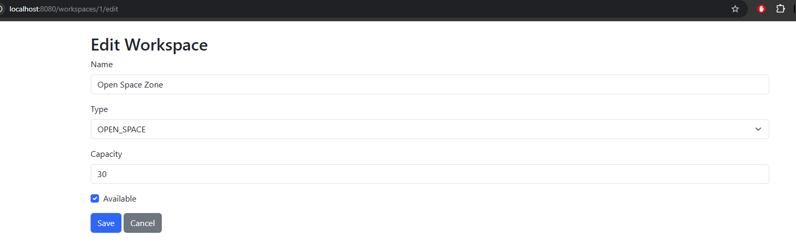

Есть кнопка для удаления рабочего места

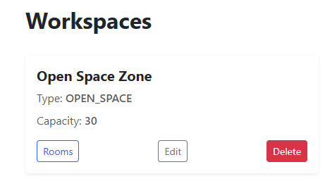

При нажатии на кнопку `Add Workspace` происходит редирект на форму для создания рабочего места.

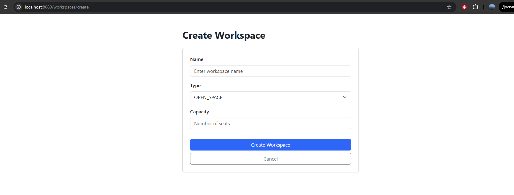

При нажатии на `Rooms` переходим к экрану с комнатами рабочего места. Есть кнопка для удаления
комнат.

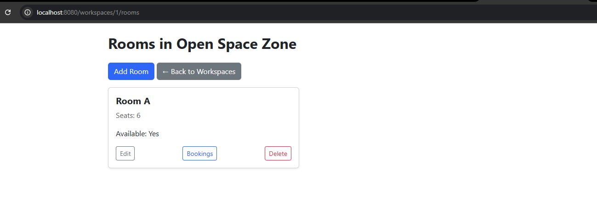

При нажатии на кнопку `Edit` происходит редирект на форму для изменения параметров комнаты.

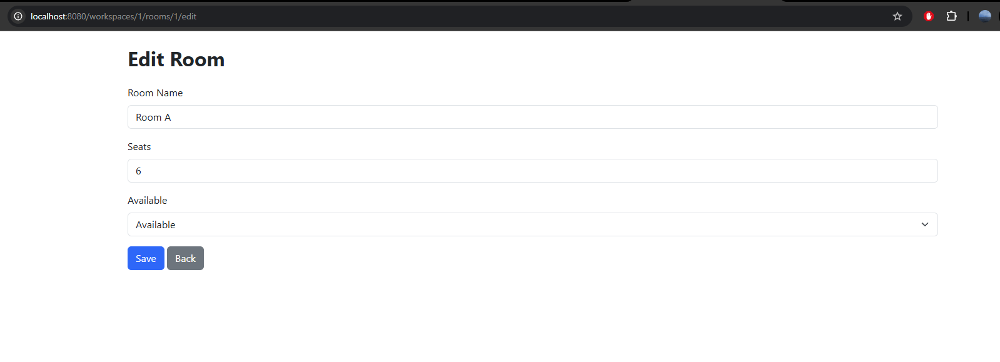

При нажатии на кнопку `Add Room` происходит редирект на форму для создания комнат.

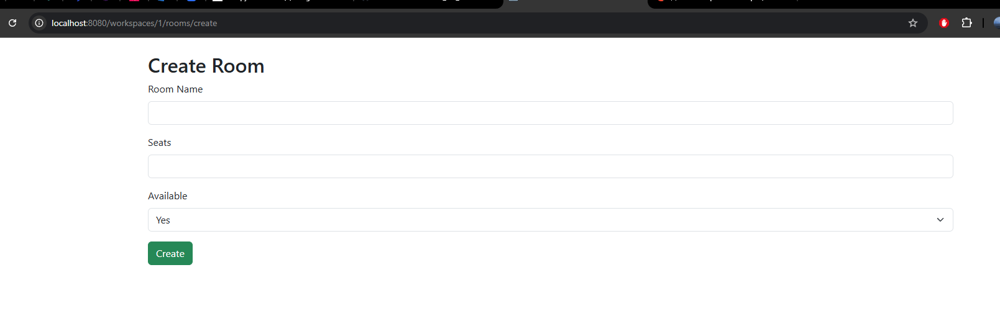

При нажатии на `Bookings` переходим к экрану с комнатами рабочего места. Есть кнопка для удаления записей о бронировании.

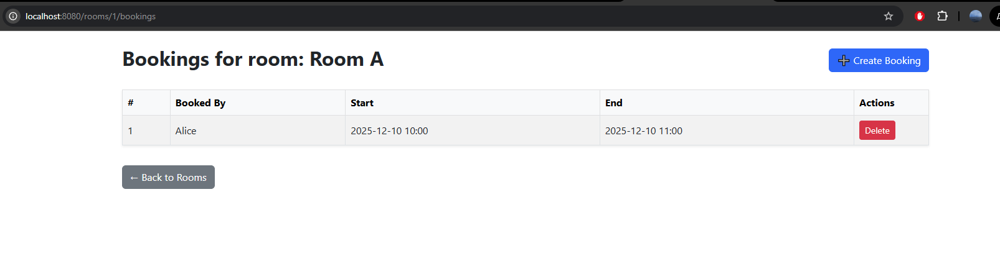

При нажатии на кнопку `Create Booking` происходит редирект на форму для создания записи.
комнат.

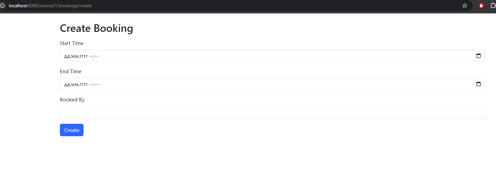

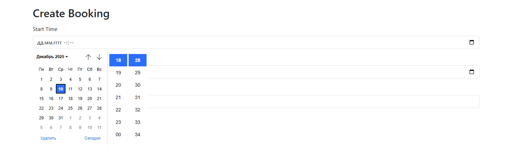

Есть проверка на установку времени в прошлом

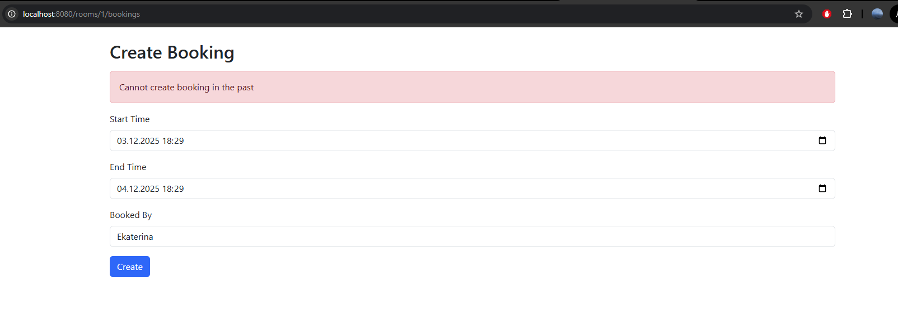

Есть проверка для установки времени конечного позже, чем стартового

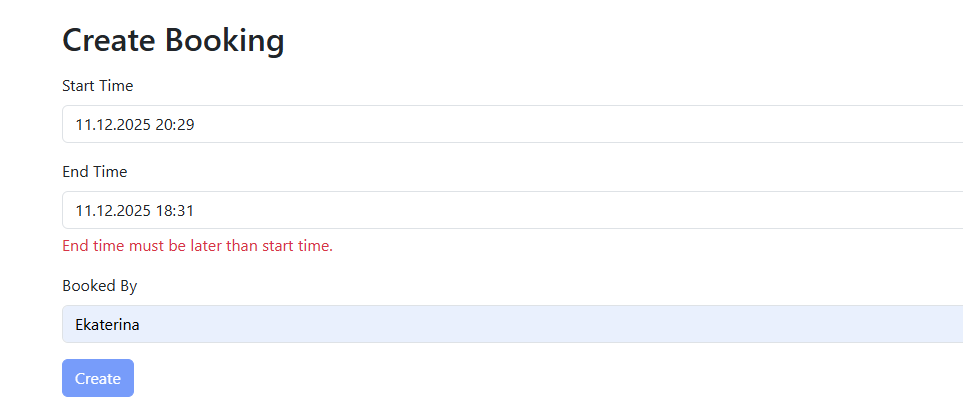

